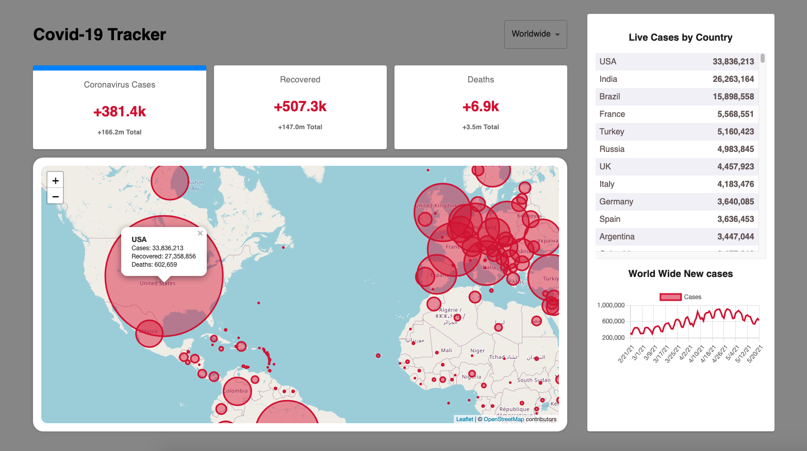

# Advanced Interactive COVID-19 Dashboard

### Objective

Create an advanced, interactive COVID-19 dashboard using React.js that displays data at two levels of granularity (country and state/province) using a zoomable map interface, with additional features to showcase frontend development skills.

### Project Overview

Develop a web application that allows users to view and interact with COVID-19 statistics on an interactive map. The dashboard provides a hierarchical view of data, starting from a country level and allowing users to drill down to state/province levels.

### Core Requirements

1. Use Create React App or Vite to set up the project.
2. Implement the following features:
- Interactive world map with zoomable interface
- Two-level hierarchical data display (country -> state/province)
- Data visualization for COVID-19 statistics
- Historical data view with customizable time range
- Search functionality for countries and states/provinces
- Responsive design for desktop and mobile devices
3. Integrate with a COVID-19 API (e.g., disease.sh, COVID-19 API from RapidAPI, or any other reliable source).
4. Use a mapping library (e.g., react-leaflet, react-simple-maps) for rendering interactive maps.
5. Implement data visualization using a charting library (e.g., recharts, Chart.js, or D3.js).
6. Use TypeScript for improved code quality and type checking.
7. Style the application using Tailwind CSS.
8. Implement proper error handling and loading states.
9. Write at least one custom hook (e.g., for fetching and managing API data).
10. Use React Router for navigation between different views.
11. Implement unit tests using Jest and React Testing Library.

### Detailed Information 

#### Map Interface
- Display a world map with countries colored based on the number of COVID-19 cases.
- Implement a legend explaining the color scheme.
- Allow users to zoom in to view state/province level data within countries.
- Use markers or color coding to represent different data metrics on the map.
- Note: Extra points for advanced mapping features or innovative use of mapping libraries.

#### Data Display
- Show relevant COVID-19 statistics (e.g., total cases, active cases, recoveries, deaths) for each level (country and state/province).
- Implement a sidebar or modal to display detailed statistics for the selected region.
- Create charts/graphs to display trends over time (e.g., new cases, recovery rate, mortality rate).
- Include vaccination data along with case statistics.

#### Interactivity
- Allow users to click on a country to view its states/provinces.
- Implement filters to adjust the time range for historical data.
- Add hover tooltips that show quick stats for the hovered country or state/province.

#### Search and Navigation
- Add a search functionality to quickly find and zoom to a specific country or state/province.
- Implement breadcrumb navigation to show the current view hierarchy (e.g., World > USA > California).

#### Responsive Design
- Ensure the dashboard is fully functional and visually appealing on both desktop and mobile devices.
- Optimize the layout for different screen sizes.

#### Performance Optimization
- Use `React.memo()` for pure functional components.
- Optimize re-renders and calculations using `useCallback` and `useMemo`.
- Implement data caching to reduce unnecessary API calls.


API: [https://covid-api.com/](https://covid-api.com/)

## Instructions to Run the Project Locally

1. **Clone the repository:**
   ```bash
   git clone https://github.com/your-username/covid19-dashboard.git
   cd covid19-dashboard
   ```

2. **Install dependencies:**
   ```bash
   npm install
   ```

3. **Start the development server:**
   ```bash
   npm start
   ```

4. **Build the project for production:**
   ```bash
   npm run build
   ```

5. **Run tests:**
   ```bash
   npm test
   ```

## Main Features Implemented

- Interactive world map with zoomable interface
- Two-level hierarchical data display (country -> state/province)
- Data visualization for COVID-19 statistics
- Historical data view with customizable time range
- Search functionality for countries and states/provinces
- Responsive design for desktop and mobile devices
- TypeScript for improved code quality and type checking
- Tailwind CSS for styling
- Error handling and loading states
- Custom hook for fetching and managing API data
- Navigation using React Router
- Unit tests with Jest and React Testing Library

## Additional Libraries/Tools Used

- **React-Leaflet:** For rendering interactive maps.
- **Recharts:** For data visualization.
- **Tailwind CSS:** For styling.
- **TypeScript:** For type checking and improved code quality.
- **Jest and React Testing Library:** For unit testing.
- **@material-ui/core:** For UI components.
- **Chart.js:** For additional data visualization.
- **Leaflet:** For map rendering.
- **Numeral:** For formatting numbers.
- **React-Chartjs-2:** For integrating Chart.js with React.
- **React-Scripts:** For configuration and scripts for Create React App.


## Challenges Faced and Solutions

1. **Challenge:** Ensuring responsive design across various devices.
   **Solution:** Used Tailwind CSS to create a responsive layout and tested the application on multiple devices.
   
2. **Challenge:** Optimizing performance for large datasets.
   **Solution:** Implemented `React.memo()`, `useCallback`, and `useMemo` to optimize re-renders and used data caching to reduce API calls.

3. **Challenge:** Managing state and API data efficiently.
   **Solution:** Created custom hooks to manage API data fetching and state management.

## Future Improvements

- Implement advanced mapping features like clustering of data points.
- Add more data metrics and visualizations.
- Improve the performance further with more optimization techniques.
- Enhance the UI/UX with more interactive elements and animations.

## Live Application

The application is deployed on [Netlify/Vercel] and can be accessed [here](https://your-deployment-url).

---

Good luck! Remember, you'll receive extra points for implementing additional optimization techniques and innovative mapping features beyond the basic requirements.




References:
  * https://reactjs.org/docs/getting-started.html
  * https://material-ui.com/getting-started/usage/
  * https://disease.sh/
